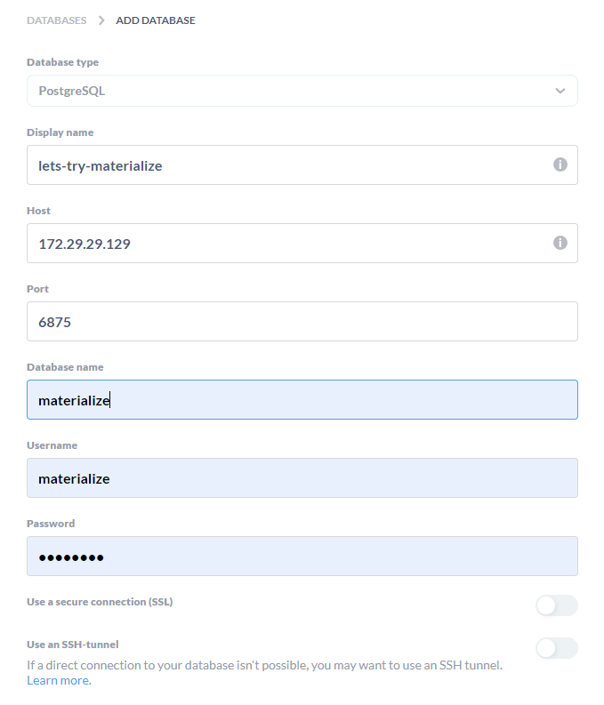

# Introduction
This repository contains a dbt project that utilizes a Materialize stream and performs stream processing. The models designed in this repo are based off the Materialize docs. In particular, the source models subscribes to a PubNub channel, from which it receives stream data and performs transformations on this data using both `view` materialization as well as Materialized' own `materializedview` materialization.

Currently the pipeline subscribes to the financial securities market orders stream: https://www.pubnub.com/developers/realtime-data-streams/financial-securities-market-orders/

# Environment Setup

 1. Clone this repository
 2. Run the install script `make install`

The install script will do the following
 - Install Python poetry
 - Install materialize daemon (aka materialized)
 - Install dbt-materialize v1.0.0 or greater
 - Install postgres client
 - Install various other libraries that can be found listed in `pyproject.toml`

# Start Materialize + Metabase

 - You can start the local materialize instance with `make mz-start`
 - Materalize will begin listening on the current shell
 - You will need to open another shell instance to perform further tasks (e.g. to start the Metabase service)

# Start Metabase
Metabase is a reporting/visualization tool which we will hook up to the postgres database we will use with Materialize.

 - You can start the Metabase service with: `make metabase-start`
 - This will spin up a docker container running Metabase on port 3000
 - A set of database connection details will also be outputted by this script. Use these details to add a database connection when navigating to this Metabase instance on `127.0.0.1:3000`
 - *Note: The host ip here is important if you are running Linux on WSL2. Even though the container is setup on localhost, Metabase will require the full host ip (i.e. of the container running in WSL network) to allow connectivity*
 

# Test DBT Connectivity
Requires: Materialize has been started in another shell
 - You can test dbt connectivity to the materialize db with `make dbt-debug`

# Run the DBT Models

 - You can run the dbt models with `make dbt-run`

# Explore Materialize models
This repository comes with a `Makefile` that contains many targets that perform Materialized commands for you, without you needing to first connect to the Materialized console.
Requires: Materialize instance running and dbt models have been executed

| Command  | Description |
| ------------- | ------------- |
| `make mz-show-sources`  | Show all Materialize sources |
| `make mz-show-views` | Show all Materialize views  |
| `make mz-stream-show view=<view name>` |  <ul><li>Stream a Materialized view to stdout</li><li>For example: `make mz-output-stream view=mzview_market_orders_avg`</li><li>To exit the stream, press `CTRL + C` </li></ul>
| `make mz-drop-source source=<source name>` | Drop a Materialize source |
| `make mz-drop-source-cascade sourc=<source name>` | Drop a Materialized source **and** any dependent views  |

# Connect to Materialize console with psql cli
Requires: Materialize has been started in another shell (see above section)
 - You can connect directly to the Materialize console to run commands with `make materialize-connect`
 - Once connected, you can run any materialize command such as `SHOW SOURCES;` to view these

# Materialize Console Commands to try out (psql)
*Requires: Connect to Materialize console (above section).*
*Recommended: Ensure you have performed a `make dbt-run` for all the materialize models to execute*

Connecting to the Materialize instance with psql allows you to perform commands to explore the materialize objects further i.e. if you wish to run a command that has not been included in the Makefile targets :-)
 - `SHOW SOURCES;` - will show all sources defined
 - `SHOW VIEWS;` - will show all the views defined with the dbt models
 - `COPY (TAIL mzview_market_orders_avg) TO stdout;` - This will output stream of data processed by the mzview_market_orders_avg dbt model with millisecond latency

# FAQ

 - Error: ```
            02:46:07  Database Error in model src_market_orders_raw (models/src_market_orders_raw.sql)
            02:46:07    catalog item 'src_market_orders_raw' already exists
            02:46:07    compiled SQL at target/run/lets_try_materialize/models/src_market_orders_raw.sql
        ```
   - *Resolution:* Remove the already existing view: `make mz-drop-source-cascade source=src_market_orders_raw`
